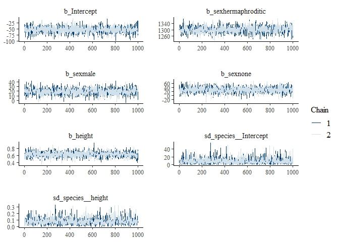
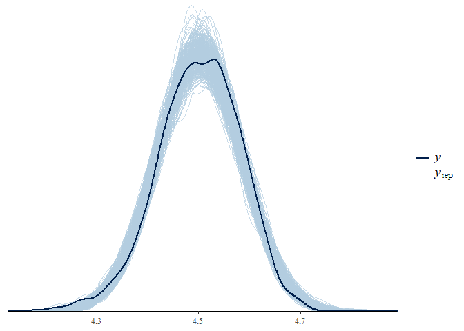

<!-- README.md is generated from README.Rmd. Please edit that file -->

# VarDecomp

<!-- badges: start -->

[](https://github.com/gabewinter/VarDecomp/actions/workflows/R-CMD-check.yaml)
[](https://app.codecov.io/gh/gabewinter/VarDecomp?branch=main)
<!-- badges: end -->

VarDecomp can be used for variance decomposition, model fit checks and
output visualizations of brms models.

## Installation

You can install the development version of VarDecomp like so:

``` r
devtools::install_github("gabewinter/VarDecomp")
#> Downloading GitHub repo gabewinter/VarDecomp@HEAD
#> parallelly   (1.36.0    -> 1.37.1   ) [CRAN]
#> listenv      (0.9.0     -> 0.9.1    ) [CRAN]
#> digest       (0.6.33    -> 0.6.35   ) [CRAN]
#> globals      (0.16.2    -> 0.16.3   ) [CRAN]
#> future       (1.33.0    -> 1.33.2   ) [CRAN]
#> vctrs        (0.6.3     -> 0.6.5    ) [CRAN]
#> stringi      (1.7.12    -> 1.8.4    ) [CRAN]
#> rlang        (1.1.1     -> 1.1.3    ) [CRAN]
#> munsell      (0.5.0     -> 0.5.1    ) [CRAN]
#> lifecycle    (1.0.3     -> 1.0.4    ) [CRAN]
#> labeling     (0.4.2     -> 0.4.3    ) [CRAN]
#> glue         (1.6.2     -> 1.7.0    ) [CRAN]
#> farver       (2.1.1     -> 2.1.2    ) [CRAN]
#> cli          (3.6.1     -> 3.6.2    ) [CRAN]
#> scales       (1.2.1     -> 1.3.0    ) [CRAN]
#> coda         (0.19-4    -> 0.19-4.1 ) [CRAN]
#> stringr      (1.5.0     -> 1.5.1    ) [CRAN]
#> mvtnorm      (1.2-2     -> 1.2-5    ) [CRAN]
#> utf8         (1.2.3     -> 1.2.4    ) [CRAN]
#> backports    (1.4.1     -> 1.5.0    ) [CRAN]
#> fansi        (1.0.4     -> 1.0.6    ) [CRAN]
#> Rcpp         (1.0.11    -> 1.0.12   ) [CRAN]
#> plyr         (1.8.8     -> 1.8.9    ) [CRAN]
#> matrixStats  (1.0.0     -> 1.3.0    ) [CRAN]
#> distribut... (0.3.2     -> 0.4.0    ) [CRAN]
#> tensorA      (0.36.2    -> 0.36.2.1 ) [CRAN]
#> checkmate    (2.2.0     -> 2.3.1    ) [CRAN]
#> withr        (2.5.0     -> 3.0.0    ) [CRAN]
#> gtable       (0.3.3     -> 0.3.5    ) [CRAN]
#> tidyselect   (1.2.0     -> 1.2.1    ) [CRAN]
#> posterior    (1.4.1     -> 1.5.0    ) [CRAN]
#> ggridges     (0.5.4     -> 0.5.6    ) [CRAN]
#> ggplot2      (3.4.3     -> 3.5.1    ) [CRAN]
#> dplyr        (1.1.2     -> 1.1.4    ) [CRAN]
#> desc         (1.4.2     -> 1.4.3    ) [CRAN]
#> ps           (1.7.5     -> 1.7.6    ) [CRAN]
#> jsonlite     (1.8.7     -> 1.8.8    ) [CRAN]
#> processx     (3.8.2     -> 3.8.4    ) [CRAN]
#> callr        (3.7.3     -> 3.7.6    ) [CRAN]
#> BH           (1.81.0-1  -> 1.84.0-0 ) [CRAN]
#> RcppEigen    (0.3.3.9.3 -> 0.3.4.0.0) [CRAN]
#> QuickJSR     (1.1.0     -> 1.1.3    ) [CRAN]
#> pkgbuild     (1.4.2     -> 1.4.4    ) [CRAN]
#> loo          (2.6.0     -> 2.7.0    ) [CRAN]
#> StanHeaders  (2.32.5    -> 2.32.8   ) [CRAN]
#> nleqslv      (3.3.4     -> 3.3.5    ) [CRAN]
#> future.apply (NA        -> 1.11.2   ) [CRAN]
#> bayesplot    (1.10.0    -> 1.11.1   ) [CRAN]
#> rstantools   (2.3.1     -> 2.4.0    ) [CRAN]
#> rstan        (2.32.5    -> 2.32.6   ) [CRAN]
#> brms         (2.19.0    -> 2.21.0   ) [CRAN]
#> Installing 51 packages: parallelly, listenv, digest, globals, future, vctrs, stringi, rlang, munsell, lifecycle, labeling, glue, farver, cli, scales, coda, stringr, mvtnorm, utf8, backports, fansi, Rcpp, plyr, matrixStats, distributional, tensorA, checkmate, withr, gtable, tidyselect, posterior, ggridges, ggplot2, dplyr, desc, ps, jsonlite, processx, callr, BH, RcppEigen, QuickJSR, pkgbuild, loo, StanHeaders, nleqslv, future.apply, bayesplot, rstantools, rstan, brms
#> Installing packages into 'C:/Users/Gabe/AppData/Local/R/win-library/4.3'
#> (as 'lib' is unspecified)
#> 
#>   There is a binary version available but the source version is later:
#>           binary source needs_compilation
#> backports  1.4.1  1.5.0              TRUE
#> 
#> package 'parallelly' successfully unpacked and MD5 sums checked
#> package 'listenv' successfully unpacked and MD5 sums checked
#> package 'digest' successfully unpacked and MD5 sums checked
#> Warning: cannot remove prior installation of package 'digest'
#> Warning in file.copy(savedcopy, lib, recursive = TRUE): problem copying
#> C:\Users\Gabe\AppData\Local\R\win-library\4.3\00LOCK\digest\libs\x64\digest.dll
#> to C:\Users\Gabe\AppData\Local\R\win-library\4.3\digest\libs\x64\digest.dll:
#> Permission denied
#> Warning: restored 'digest'
#> package 'globals' successfully unpacked and MD5 sums checked
#> package 'future' successfully unpacked and MD5 sums checked
#> package 'vctrs' successfully unpacked and MD5 sums checked
#> Warning: cannot remove prior installation of package 'vctrs'
#> Warning in file.copy(savedcopy, lib, recursive = TRUE): problem copying
#> C:\Users\Gabe\AppData\Local\R\win-library\4.3\00LOCK\vctrs\libs\x64\vctrs.dll
#> to C:\Users\Gabe\AppData\Local\R\win-library\4.3\vctrs\libs\x64\vctrs.dll:
#> Permission denied
#> Warning: restored 'vctrs'
#> package 'stringi' successfully unpacked and MD5 sums checked
#> Warning: cannot remove prior installation of package 'stringi'
#> Warning in file.copy(savedcopy, lib, recursive = TRUE): problem copying
#> C:\Users\Gabe\AppData\Local\R\win-library\4.3\00LOCK\stringi\libs\x64\stringi.dll
#> to C:\Users\Gabe\AppData\Local\R\win-library\4.3\stringi\libs\x64\stringi.dll:
#> Permission denied
#> Warning: restored 'stringi'
#> package 'rlang' successfully unpacked and MD5 sums checked
#> Warning: cannot remove prior installation of package 'rlang'
#> Warning in file.copy(savedcopy, lib, recursive = TRUE): problem copying
#> C:\Users\Gabe\AppData\Local\R\win-library\4.3\00LOCK\rlang\libs\x64\rlang.dll
#> to C:\Users\Gabe\AppData\Local\R\win-library\4.3\rlang\libs\x64\rlang.dll:
#> Permission denied
#> Warning: restored 'rlang'
#> package 'munsell' successfully unpacked and MD5 sums checked
#> package 'lifecycle' successfully unpacked and MD5 sums checked
#> package 'labeling' successfully unpacked and MD5 sums checked
#> package 'glue' successfully unpacked and MD5 sums checked
#> Warning: cannot remove prior installation of package 'glue'
#> Warning in file.copy(savedcopy, lib, recursive = TRUE): problem copying
#> C:\Users\Gabe\AppData\Local\R\win-library\4.3\00LOCK\glue\libs\x64\glue.dll to
#> C:\Users\Gabe\AppData\Local\R\win-library\4.3\glue\libs\x64\glue.dll:
#> Permission denied
#> Warning: restored 'glue'
#> package 'farver' successfully unpacked and MD5 sums checked
#> Warning: cannot remove prior installation of package 'farver'
#> Warning in file.copy(savedcopy, lib, recursive = TRUE): problem copying
#> C:\Users\Gabe\AppData\Local\R\win-library\4.3\00LOCK\farver\libs\x64\farver.dll
#> to C:\Users\Gabe\AppData\Local\R\win-library\4.3\farver\libs\x64\farver.dll:
#> Permission denied
#> Warning: restored 'farver'
#> package 'cli' successfully unpacked and MD5 sums checked
#> Warning: cannot remove prior installation of package 'cli'
#> Warning in file.copy(savedcopy, lib, recursive = TRUE): problem copying
#> C:\Users\Gabe\AppData\Local\R\win-library\4.3\00LOCK\cli\libs\x64\cli.dll to
#> C:\Users\Gabe\AppData\Local\R\win-library\4.3\cli\libs\x64\cli.dll: Permission
#> denied
#> Warning: restored 'cli'
#> package 'scales' successfully unpacked and MD5 sums checked
#> package 'coda' successfully unpacked and MD5 sums checked
#> package 'stringr' successfully unpacked and MD5 sums checked
#> package 'mvtnorm' successfully unpacked and MD5 sums checked
#> Warning: cannot remove prior installation of package 'mvtnorm'
#> Warning in file.copy(savedcopy, lib, recursive = TRUE): problem copying
#> C:\Users\Gabe\AppData\Local\R\win-library\4.3\00LOCK\mvtnorm\libs\x64\mvtnorm.dll
#> to C:\Users\Gabe\AppData\Local\R\win-library\4.3\mvtnorm\libs\x64\mvtnorm.dll:
#> Permission denied
#> Warning: restored 'mvtnorm'
#> package 'utf8' successfully unpacked and MD5 sums checked
#> Warning: cannot remove prior installation of package 'utf8'
#> Warning in file.copy(savedcopy, lib, recursive = TRUE): problem copying
#> C:\Users\Gabe\AppData\Local\R\win-library\4.3\00LOCK\utf8\libs\x64\utf8.dll to
#> C:\Users\Gabe\AppData\Local\R\win-library\4.3\utf8\libs\x64\utf8.dll:
#> Permission denied
#> Warning: restored 'utf8'
#> package 'fansi' successfully unpacked and MD5 sums checked
#> Warning: cannot remove prior installation of package 'fansi'
#> Warning in file.copy(savedcopy, lib, recursive = TRUE): problem copying
#> C:\Users\Gabe\AppData\Local\R\win-library\4.3\00LOCK\fansi\libs\x64\fansi.dll
#> to C:\Users\Gabe\AppData\Local\R\win-library\4.3\fansi\libs\x64\fansi.dll:
#> Permission denied
#> Warning: restored 'fansi'
#> package 'Rcpp' successfully unpacked and MD5 sums checked
#> Warning: cannot remove prior installation of package 'Rcpp'
#> Warning in file.copy(savedcopy, lib, recursive = TRUE): problem copying
#> C:\Users\Gabe\AppData\Local\R\win-library\4.3\00LOCK\Rcpp\libs\x64\Rcpp.dll to
#> C:\Users\Gabe\AppData\Local\R\win-library\4.3\Rcpp\libs\x64\Rcpp.dll:
#> Permission denied
#> Warning: restored 'Rcpp'
#> package 'plyr' successfully unpacked and MD5 sums checked
#> Warning: cannot remove prior installation of package 'plyr'
#> Warning in file.copy(savedcopy, lib, recursive = TRUE): problem copying
#> C:\Users\Gabe\AppData\Local\R\win-library\4.3\00LOCK\plyr\libs\x64\plyr.dll to
#> C:\Users\Gabe\AppData\Local\R\win-library\4.3\plyr\libs\x64\plyr.dll:
#> Permission denied
#> Warning: restored 'plyr'
#> package 'matrixStats' successfully unpacked and MD5 sums checked
#> Warning: cannot remove prior installation of package 'matrixStats'
#> Warning in file.copy(savedcopy, lib, recursive = TRUE): problem copying
#> C:\Users\Gabe\AppData\Local\R\win-library\4.3\00LOCK\matrixStats\libs\x64\matrixStats.dll
#> to
#> C:\Users\Gabe\AppData\Local\R\win-library\4.3\matrixStats\libs\x64\matrixStats.dll:
#> Permission denied
#> Warning: restored 'matrixStats'
#> package 'distributional' successfully unpacked and MD5 sums checked
#> package 'tensorA' successfully unpacked and MD5 sums checked
#> Warning: cannot remove prior installation of package 'tensorA'
#> Warning in file.copy(savedcopy, lib, recursive = TRUE): problem copying
#> C:\Users\Gabe\AppData\Local\R\win-library\4.3\00LOCK\tensorA\libs\x64\tensorA.dll
#> to C:\Users\Gabe\AppData\Local\R\win-library\4.3\tensorA\libs\x64\tensorA.dll:
#> Permission denied
#> Warning: restored 'tensorA'
#> package 'checkmate' successfully unpacked and MD5 sums checked
#> Warning: cannot remove prior installation of package 'checkmate'
#> Warning in file.copy(savedcopy, lib, recursive = TRUE): problem copying
#> C:\Users\Gabe\AppData\Local\R\win-library\4.3\00LOCK\checkmate\libs\x64\checkmate.dll
#> to
#> C:\Users\Gabe\AppData\Local\R\win-library\4.3\checkmate\libs\x64\checkmate.dll:
#> Permission denied
#> Warning: restored 'checkmate'
#> package 'withr' successfully unpacked and MD5 sums checked
#> package 'gtable' successfully unpacked and MD5 sums checked
#> package 'tidyselect' successfully unpacked and MD5 sums checked
#> package 'posterior' successfully unpacked and MD5 sums checked
#> package 'ggridges' successfully unpacked and MD5 sums checked
#> package 'ggplot2' successfully unpacked and MD5 sums checked
#> package 'dplyr' successfully unpacked and MD5 sums checked
#> Warning: cannot remove prior installation of package 'dplyr'
#> Warning in file.copy(savedcopy, lib, recursive = TRUE): problem copying
#> C:\Users\Gabe\AppData\Local\R\win-library\4.3\00LOCK\dplyr\libs\x64\dplyr.dll
#> to C:\Users\Gabe\AppData\Local\R\win-library\4.3\dplyr\libs\x64\dplyr.dll:
#> Permission denied
#> Warning: restored 'dplyr'
#> package 'desc' successfully unpacked and MD5 sums checked
#> package 'ps' successfully unpacked and MD5 sums checked
#> Warning: cannot remove prior installation of package 'ps'
#> Warning in file.copy(savedcopy, lib, recursive = TRUE): problem copying
#> C:\Users\Gabe\AppData\Local\R\win-library\4.3\00LOCK\ps\libs\x64\ps.dll to
#> C:\Users\Gabe\AppData\Local\R\win-library\4.3\ps\libs\x64\ps.dll: Permission
#> denied
#> Warning: restored 'ps'
#> package 'jsonlite' successfully unpacked and MD5 sums checked
#> Warning: cannot remove prior installation of package 'jsonlite'
#> Warning in file.copy(savedcopy, lib, recursive = TRUE): problem copying
#> C:\Users\Gabe\AppData\Local\R\win-library\4.3\00LOCK\jsonlite\libs\x64\jsonlite.dll
#> to
#> C:\Users\Gabe\AppData\Local\R\win-library\4.3\jsonlite\libs\x64\jsonlite.dll:
#> Permission denied
#> Warning: restored 'jsonlite'
#> package 'processx' successfully unpacked and MD5 sums checked
#> Warning: cannot remove prior installation of package 'processx'
#> Warning in file.copy(savedcopy, lib, recursive = TRUE): problem copying
#> C:\Users\Gabe\AppData\Local\R\win-library\4.3\00LOCK\processx\libs\x64\processx.dll
#> to
#> C:\Users\Gabe\AppData\Local\R\win-library\4.3\processx\libs\x64\processx.dll:
#> Permission denied
#> Warning: restored 'processx'
#> package 'callr' successfully unpacked and MD5 sums checked
#> package 'BH' successfully unpacked and MD5 sums checked
#> package 'RcppEigen' successfully unpacked and MD5 sums checked
#> package 'QuickJSR' successfully unpacked and MD5 sums checked
#> Warning: cannot remove prior installation of package 'QuickJSR'
#> Warning in file.copy(savedcopy, lib, recursive = TRUE): problem copying
#> C:\Users\Gabe\AppData\Local\R\win-library\4.3\00LOCK\QuickJSR\libs\x64\QuickJSR.dll
#> to
#> C:\Users\Gabe\AppData\Local\R\win-library\4.3\QuickJSR\libs\x64\QuickJSR.dll:
#> Permission denied
#> Warning: restored 'QuickJSR'
#> package 'pkgbuild' successfully unpacked and MD5 sums checked
#> package 'loo' successfully unpacked and MD5 sums checked
#> package 'StanHeaders' successfully unpacked and MD5 sums checked
#> Warning: cannot remove prior installation of package 'StanHeaders'
#> Warning in file.copy(savedcopy, lib, recursive = TRUE): problem copying
#> C:\Users\Gabe\AppData\Local\R\win-library\4.3\00LOCK\StanHeaders\libs\x64\StanHeaders.dll
#> to
#> C:\Users\Gabe\AppData\Local\R\win-library\4.3\StanHeaders\libs\x64\StanHeaders.dll:
#> Permission denied
#> Warning: restored 'StanHeaders'
#> package 'nleqslv' successfully unpacked and MD5 sums checked
#> package 'future.apply' successfully unpacked and MD5 sums checked
#> package 'bayesplot' successfully unpacked and MD5 sums checked
#> package 'rstantools' successfully unpacked and MD5 sums checked
#> package 'rstan' successfully unpacked and MD5 sums checked
#> Warning: cannot remove prior installation of package 'rstan'
#> Warning in file.copy(savedcopy, lib, recursive = TRUE): problem copying
#> C:\Users\Gabe\AppData\Local\R\win-library\4.3\00LOCK\rstan\libs\x64\rstan.dll
#> to C:\Users\Gabe\AppData\Local\R\win-library\4.3\rstan\libs\x64\rstan.dll:
#> Permission denied
#> Warning: restored 'rstan'
#> package 'brms' successfully unpacked and MD5 sums checked
#> 
#> The downloaded binary packages are in
#>  C:\Users\Gabe\AppData\Local\Temp\Rtmp0EaISb\downloaded_packages
#> installing the source package 'backports'
#> Warning in i.p(...): installation of package 'backports' had non-zero exit
#> status
#> ── R CMD build ─────────────────────────────────────────────────────────────────
#>          checking for file 'C:\Users\Gabe\AppData\Local\Temp\Rtmp0EaISb\remotes3e884c9365a4\gabewinter-VarDecomp-ecdbef7/DESCRIPTION' ...     checking for file 'C:\Users\Gabe\AppData\Local\Temp\Rtmp0EaISb\remotes3e884c9365a4\gabewinter-VarDecomp-ecdbef7/DESCRIPTION' ...   ✔  checking for file 'C:\Users\Gabe\AppData\Local\Temp\Rtmp0EaISb\remotes3e884c9365a4\gabewinter-VarDecomp-ecdbef7/DESCRIPTION' (398ms)
#>       ─  preparing 'VarDecomp': (348ms)
#>    checking DESCRIPTION meta-information ...     checking DESCRIPTION meta-information ...   ✔  checking DESCRIPTION meta-information
#>       ─  checking for LF line-endings in source and make files and shell scripts
#>   ─  checking for empty or unneeded directories
#>       ─  building 'VarDecomp_0.0.0.9000.tar.gz'
#>      
#> 
#> Installing package into 'C:/Users/Gabe/AppData/Local/R/win-library/4.3'
#> (as 'lib' is unspecified)
```

## Documentation

Full documentation website on: <https://gabewinter.github.io/VarDecomp>

## Example

``` r
library(VarDecomp)

md = dplyr::starwars

mod = brms_model(Chainset = "long", 
           Response = "mass", 
           FixedEffect = c("sex","height"), 
           RandomEffect = "species", 
           RandomSlope = "height", 
           Family = "gaussian", 
           Data = md, 
          Seed = 0405)
#> [1] "No problem 👏"
#> Warning: Rows containing NAs were excluded from the model.
#> Compiling Stan program...
#> Start sampling

print(mod)
#>  Family: gaussian 
#>   Links: mu = identity; sigma = identity 
#> Formula: mass ~ sex + height + (1 + height | species) 
#>    Data: Data (Number of observations: 58) 
#>   Draws: 2 chains, each with iter = 30000; warmup = 15000; thin = 15;
#>          total post-warmup draws = 2000
#> 
#> Multilevel Hyperparameters:
#> ~species (Number of levels: 31) 
#>                       Estimate Est.Error l-95% CI u-95% CI Rhat Bulk_ESS
#> sd(Intercept)             8.64      7.44     0.31    28.27 1.00     2065
#> sd(height)                0.08      0.05     0.01     0.21 1.00     1801
#> cor(Intercept,height)    -0.36      0.57    -0.99     0.86 1.00     1744
#>                       Tail_ESS
#> sd(Intercept)             1944
#> sd(height)                1754
#> cor(Intercept,height)     1739
#> 
#> Regression Coefficients:
#>                   Estimate Est.Error l-95% CI u-95% CI Rhat Bulk_ESS Tail_ESS
#> Intercept           -53.20     13.15   -80.03   -27.94 1.00     1856     1550
#> sexhermaphroditic  1300.65     20.01  1260.37  1340.48 1.00     1838     1582
#> sexmale              19.45      6.48     6.46    32.05 1.00     1936     1977
#> sexnone              28.86     14.05     1.31    55.94 1.00     1927     1688
#> height                0.63      0.07     0.49     0.78 1.00     2072     1690
#> 
#> Further Distributional Parameters:
#>       Estimate Est.Error l-95% CI u-95% CI Rhat Bulk_ESS Tail_ESS
#> sigma    14.54      1.93    11.12    18.66 1.00     1986     1796
#> 
#> Draws were sampled using sampling(NUTS). For each parameter, Bulk_ESS
#> and Tail_ESS are effective sample size measures, and Rhat is the potential
#> scale reduction factor on split chains (at convergence, Rhat = 1).

plot(mod)
```


