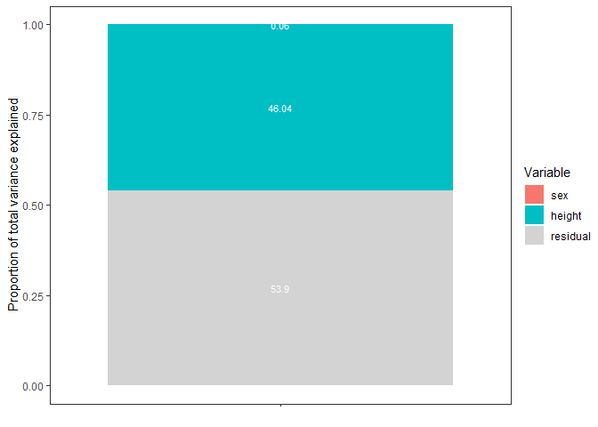

<!-- README.md is generated from README.Rmd. Please edit that file -->

# VarDecomp

<!-- badges: start -->

[](https://github.com/gabewinter/VarDecomp/actions/workflows/R-CMD-check.yaml)
[](https://app.codecov.io/gh/gabewinter/VarDecomp?branch=main)
<!-- badges: end -->

VarDecomp can be used for variance decomposition, model fit checks and
output visualizations of brms models.

## Installation

You can install the development version of VarDecomp like so:

``` r
devtools::install_github("gabewinter/VarDecomp")
```

## Documentation

Full documentation website on: <https://gabewinter.github.io/VarDecomp>

## Example

``` r
md = dplyr::starwars

mod = VarDecomp::brms_model(Chainset = 1, 
           Response = "mass", 
           FixedEffect = c("sex","height"),
           RandomEffect = "species", 
           Family = "gaussian", 
           Data = md, 
           Seed = 0405)
#> Warning: replacing previous import 'posterior::ess_bulk' by 'rstan::ess_bulk'
#> when loading 'VarDecomp'
#> Warning: replacing previous import 'posterior::ess_tail' by 'rstan::ess_tail'
#> when loading 'VarDecomp'
#> [1] "No problems so far 😀"
#> Warning: Rows containing NAs were excluded from the model.
#> Compiling Stan program...
#> Start sampling

VarDecomp::model_fit(mod, Group = "sex")
#> No divergences to plot.
#> Using all posterior draws for ppc type 'loo_pit_qq' by default.
#> Warning: Some Pareto k diagnostic values are too high. See help('pareto-k-diagnostic') for details.
#> Warning: Some Pareto k diagnostic values are too high. See help('pareto-k-diagnostic') for details.
#> Using all posterior draws for ppc type 'violin_grouped' by default.
#> $`R-hat and Effective sample size`
#> # A tibble: 1 × 2
#>    Rhat EffectiveSampleSize
#>   <dbl>               <dbl>
#> 1  1.00               1639.
#> 
#> $`Traceplots plot`
```


    #> 
    #> $`Posterior predictive check - Density overlay plot`


    #> 
    #> $`Posterior predictive check - LOO-PIT-QQ plot`


    #> 
    #> $`Posterior predictive check - Group density overlay plot`
    #> $`Posterior predictive check - Group density overlay plot`$GroupPlot_sex
    #> Warning: Groups with fewer than two datapoints have been dropped.
    #> ℹ Set `drop = FALSE` to consider such groups for position adjustment purposes.


``` r

VarDecomp::model_summary(mod)
#> New names:
#> • `sex` -> `sex...1`
#> • `sex` -> `sex...3`
#> # A tibble: 12 × 6
#>    variable                 mean   median     sd lower_HPD upper_HPD
#>    <chr>                   <dbl>    <dbl>  <dbl>     <dbl>     <dbl>
#>  1 Intercept             -56.0    -55.8   13.6     -80.8     -28.2  
#>  2 sexhermaphroditic    1301.    1301.    19.3    1266.     1340.   
#>  3 sexmale                20.1     20.2    6.54      6.42     32.3  
#>  4 sexnone                35.0     35.0   14.1       6.37     63.5  
#>  5 height                  0.646    0.644  0.072     0.497     0.778
#>  6 R2_height               0.018    0.018  0.004     0.011     0.026
#>  7 R2_sexmale              0.003    0.003  0.002     0         0.006
#>  8 R2_sexnone              0.003    0.003  0.002     0         0.007
#>  9 R2_sexhermaphroditic    0.965    0.966  0.006     0.954     0.976
#> 10 R2_sum_fixed_effects    0.989    0.989  0.003     0.983     0.993
#> 11 R2_species              0.003    0.002  0.003     0         0.008
#> 12 R2_residual             0.008    0.008  0.002     0.005     0.013

VarDecomp::plot_intervals(mod)
#> Warning: Removed 6000 rows containing missing values or values outside the scale range
#> (`stat_slabinterval()`).
```


``` r

PS = VarDecomp::var_decomp(mod)
#> New names:
#> • `sex` -> `sex...1`
#> • `sex` -> `sex...3`

VarDecomp::plot_R2(PS)
```


