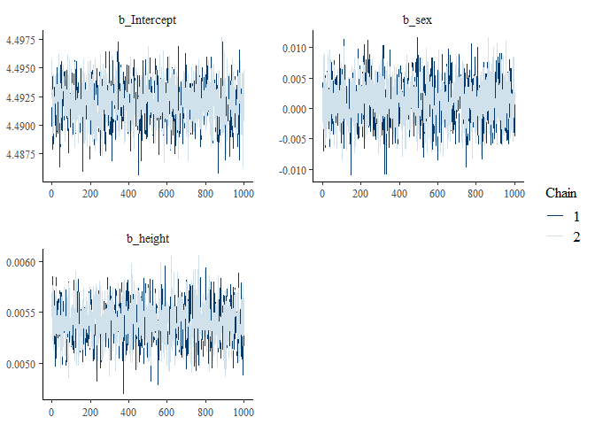

<!-- README.md is generated from README.Rmd. Please edit that file -->

# VarDecomp

<!-- badges: start -->

[](https://github.com/gabewinter/VarDecomp/actions/workflows/R-CMD-check.yaml)
[](https://app.codecov.io/gh/gabewinter/VarDecomp?branch=main)
<!-- badges: end -->

VarDecomp can be used for variance decomposition, model fit checks and
output visualizations of brms models.

## Installation

You can install the development version of VarDecomp like so:

``` r
devtools::install_github("gabewinter/VarDecomp")
```

## Documentation

Full documentation website on: <https://gabewinter.github.io/VarDecomp>

## Example

``` r
library(VarDecomp)

md = dplyr::starwars

mod = brms_model(Chainset = "long", 
           Response = "mass", 
           FixedEffect = c("sex","height"), 
           RandomEffect = "species", 
           RandomSlope = "height", 
           Family = "gaussian", 
           Data = md, 
          Seed = 0405)
#> [1] "No problem 🥳"
#> Warning: Rows containing NAs were excluded from the model.
#> Compiling Stan program...
#> Start sampling

print(mod)
#>  Family: gaussian 
#>   Links: mu = identity; sigma = identity 
#> Formula: mass ~ sex + height + (1 + height | species) 
#>    Data: Data (Number of observations: 58) 
#>   Draws: 2 chains, each with iter = 30000; warmup = 15000; thin = 15;
#>          total post-warmup draws = 2000
#> 
#> Multilevel Hyperparameters:
#> ~species (Number of levels: 31) 
#>                       Estimate Est.Error l-95% CI u-95% CI Rhat Bulk_ESS
#> sd(Intercept)             8.64      7.44     0.31    28.27 1.00     2065
#> sd(height)                0.08      0.05     0.01     0.21 1.00     1801
#> cor(Intercept,height)    -0.36      0.57    -0.99     0.86 1.00     1744
#>                       Tail_ESS
#> sd(Intercept)             1944
#> sd(height)                1754
#> cor(Intercept,height)     1739
#> 
#> Regression Coefficients:
#>                   Estimate Est.Error l-95% CI u-95% CI Rhat Bulk_ESS Tail_ESS
#> Intercept           -53.20     13.15   -80.03   -27.94 1.00     1856     1550
#> sexhermaphroditic  1300.65     20.01  1260.37  1340.48 1.00     1838     1582
#> sexmale              19.45      6.48     6.46    32.05 1.00     1936     1977
#> sexnone              28.86     14.05     1.31    55.94 1.00     1927     1688
#> height                0.63      0.07     0.49     0.78 1.00     2072     1690
#> 
#> Further Distributional Parameters:
#>       Estimate Est.Error l-95% CI u-95% CI Rhat Bulk_ESS Tail_ESS
#> sigma    14.54      1.93    11.12    18.66 1.00     1986     1796
#> 
#> Draws were sampled using sampling(NUTS). For each parameter, Bulk_ESS
#> and Tail_ESS are effective sample size measures, and Rhat is the potential
#> scale reduction factor on split chains (at convergence, Rhat = 1).

plot(mod)
```


