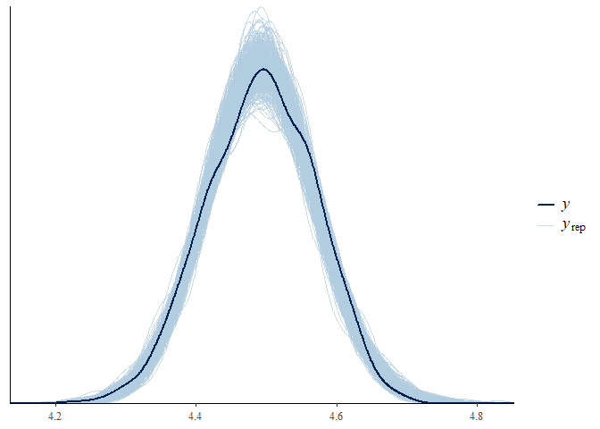
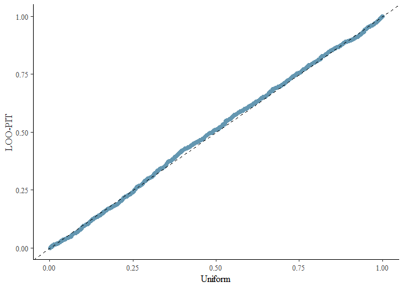

<!-- README.md is generated from README.Rmd. Please edit that file -->

# VarDecomp

<!-- badges: start -->

[](https://github.com/gabewinter/VarDecomp/actions/workflows/R-CMD-check.yaml)
[](https://app.codecov.io/gh/gabewinter/VarDecomp?branch=main)
<!-- badges: end -->

VarDecomp can be used for variance decomposition, model fit checks and
output visualizations of brms models.

## Installation

You can install the development version of VarDecomp like so:

``` r
devtools::install_github("gabewinter/VarDecomp")
```

## Documentation

Full documentation website on: <https://gabewinter.github.io/VarDecomp>

## Example

``` r
library(tidyverse)

md = tibble(
  sex = sample(rep(c(-0.5, 0.5), each = 500)),
  species = sample(rep(c("species1","species2","species3","species4","species5"), each = 200))) %>% 

## Create a variables 
  dplyr::mutate(height = rnorm(1000, mean = 170, sd = 10),
                mass = 5 + 0.5 * height + rnorm(1000, mean = 0, sd = 5)) %>% 
  dplyr::mutate(height = height - mean(height),
                mass = log(mass))


mod = brms_model(Chainset = 2,
                 Response = "mass", 
                 FixedEffect = c("sex","height"), 
                 Family = "gaussian", 
                 Data = md)
#> [1] "No problems so far 🙌"
#> Compiling Stan program...
#> Start sampling

model_fit(mod, Group = "sex")
#> No divergences to plot.
#> Using all posterior draws for ppc type 'loo_pit_qq' by default.
#> Using all posterior draws for ppc type 'violin_grouped' by default.
#> $`R-hat and Effective sample size`
#> # A tibble: 1 × 2
#>    Rhat EffectiveSampleSize
#>   <dbl>               <dbl>
#> 1  1.00               1650.
#> 
#> $`Traceplots plot`
```


    #> 
    #> $`Posterior predictive check - Density overlay plot`



    #> 
    #> $`Posterior predictive check - LOO-PIT-QQ plot`



    #> 
    #> $`Posterior predictive check - Group density overlay plot`
    #> $`Posterior predictive check - Group density overlay plot`$GroupPlot_sex


``` r

model_summary(mod)
#> # A tibble: 7 × 6
#>   variable              mean median    sd lower_HPD upper_HPD
#>   <chr>                <dbl>  <dbl> <dbl>     <dbl>     <dbl>
#> 1 Intercept            4.49   4.49  0.002     4.49      4.50 
#> 2 sex                  0.001  0.001 0.004    -0.006     0.008
#> 3 height               0.005  0.005 0         0.005     0.006
#> 4 R2_sex               0.001  0     0.001     0         0.002
#> 5 R2_height            0.46   0.461 0.021     0.417     0.499
#> 6 R2_sum_fixed_effects 0.461  0.462 0.021     0.418     0.499
#> 7 R2_residual          0.539  0.538 0.021     0.501     0.582

plot_intervals(mod)
```


``` r

PS = var_decomp(mod)

plot_R2(PS)
```


